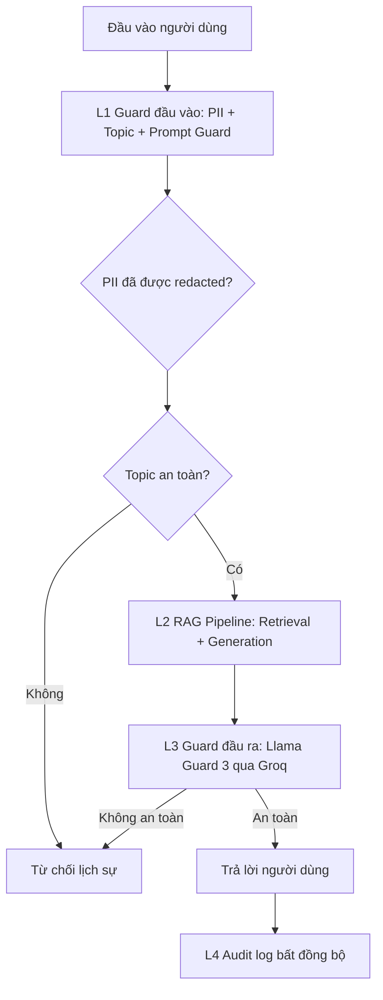

# Blueprint Production Cho Hệ Thống Đánh Giá Và Guardrails

## Định nghĩa SLO

| Metric | Target | Ngưỡng cảnh báo | Mức độ |
|---|---:|---:|---|
| Faithfulness | >= 0.85 | < 0.80 trong 30 phút | P2 |
| Answer Relevancy | >= 0.80 | < 0.75 trong 30 phút | P2 |
| Context Precision | >= 0.70 | < 0.65 trong 1 giờ | P3 |
| Context Recall | >= 0.75 | < 0.70 trong 1 giờ | P3 |
| P95 latency có guardrails | < 2.5s | > 3s trong 5 phút | P1 |
| Tỷ lệ phát hiện của guardrail | >= 90% | < 85% | P2 |
| False positive rate | < 5% | > 10% | P2 |

## Sơ đồ kiến trúc

Chú thích độ trễ được đo trong `phase-c/latency_benchmark.csv`: L1 là kiểm tra đầu vào, L2 là RAG generation, L3 là Llama Guard/output guard, và tổng thời gian là end-to-end request time.

## Playbook cảnh báo

### Incident: Faithfulness giảm xuống dưới 0.80

**Mức độ:** P2  
**Cách phát hiện:** Eval gate liên tục hoặc RAGAS scheduled run.

**Nguyên nhân có khả năng cao:** retriever trả về chunk không liên quan, prompt bị thay đổi, hoặc corpus được cập nhật nhưng chưa re-index.

**Các bước điều tra:** so sánh context precision/context recall, kiểm tra bottom 10 failures, diff prompt và phiên bản corpus.

**Cách xử lý:** tune `top_k`, thêm reranking, rollback prompt, hoặc build lại index.

### Incident: P95 latency vượt 3 giây

**Mức độ:** P1  
**Cách phát hiện:** latency benchmark hoặc telemetry production.

**Nguyên nhân có khả năng cao:** LLM generation chậm, độ trễ mạng/API Groq cao, hoặc context quá dài.

**Các bước điều tra:** tách timing theo L1/L2/L3, so sánh baseline với guarded pipeline, kiểm tra timeout/retry log.

**Cách xử lý:** giảm kích thước context, cache topic check, đặt API timeout, hoặc dùng endpoint guardrail nhanh hơn.

### Incident: Guardrail false negative

**Mức độ:** P2  
**Cách phát hiện:** adversarial regression test, user report, hoặc review audit log.

**Nguyên nhân có khả năng cao:** thiếu pattern prompt injection, Llama Guard lỗi/outage, hoặc nội dung unsafe được diễn đạt gián tiếp.

**Các bước điều tra:** reproduce bằng input/output đã lưu, phân loại kiểu attack, kiểm tra raw result của output guard.

**Cách xử lý:** thêm prompt guard pattern/classifier, cập nhật adversarial test set, và fail closed khi output guard lỗi.

## Phân tích chi phí

Giả định: 100k production queries/tháng.

| Thành phần | Chi phí đơn vị | Volume | Chi phí tháng |
|---|---:|---:|---:|
| RAG generation với GPT-4o-mini | $0.001/query | 100k | $100 |
| RAGAS continuous eval sample | $0.01/query | 1k | $10 |
| LLM judge tier 1 | $0.001/query | 10k | $10 |
| LLM judge tier 2 | $0.05/query | 1k | $50 |
| Presidio input guard | self-hosted | 100k | $0 |
| Llama Guard 3 qua Groq | free/low-tier API | 100k | biến động |
| Tổng ước tính |  |  | khoảng $170 + chi phí Groq |

Cơ hội tối ưu chi phí: sample một phần traffic eval, cache embedding/topic decision, dùng judge model rẻ hơn cho case dễ, và chỉ dùng judge mạnh khi có bất đồng hoặc confidence thấp.
